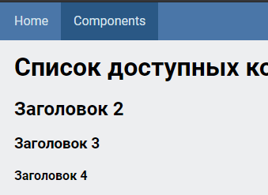

## Screen


## Project setup
```
npm install
npm run serve
npm run build
npm run lint
```


## Заметки
Сторонние UI-библиотеки не используются.  

Похоже что здесь кроме цветов и заголовков больше и нет ничего.  
Но вроде-как я же делал цвета бордюров и всё такое.  
Эти наработки можно добавить в naked-css
